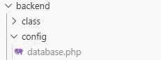

# My Cinema

Ce projet est une application web de gestion de cinéma réalisée en PHP. Elle permet de rechercher des films, de gérer les membres, les abonnements et les séances.

## Sommaire
1. [📋 Prérequis](#-prérequis)
2. [🚀 Installation](#-installation)
3. [🏁 Lancement](#-lancement)

---

## 📋 Prérequis

Avant de commencer, assurez-vous d'avoir installé les outils suivants sur votre machine :
* **Serveur Web :** Apache (via XAMPP, WAMP ou MAMP)
* **Langage :** PHP (version 7.4 ou supérieure recommandée)
* **Base de données :** MySQL / MariaDB
* **Gestionnaire de version :** Git

---

## 🚀 Installation

Suivez ces étapes pour installer le projet localement :

### 1. Cloner le projet

Ouvrez votre terminal dans le dossier où vous souhaitez importer le projet et lancez :
```bash
git clone https://github.com/RenaudBaussart/my_cinema.git
cd my_cinema
```
### 2. Configuration de la base de données

1. Démarrez vos services Apache et MySQL.
2. Accédez à phpMyAdmin (http://localhost/phpmyadmin).
3. Créez une nouvelle base de données nommée my_cinema ou un autre nom selon votre configuration.
4. Importez le fichier SQL fourni dans le projet :
   * Cliquez sur l'onglet "Importer".
   * Cliquez sur "Choisir un fichier" et sélectionnez le fichier .sql situé dans .docs/BDD/script.sql.
   * Cliquez sur le bouton "Importer" en bas de page.

   **OU**

   * Cliquez sur l'onglet SQL.
   * Copiez-collez le code contenu dans le fichier .sql situé dans .docs/BDD/script.sql et validez.

### 3. Configuration de la connexion PHP

1. Créez un fichier de configuration pour la base de données comme ceci :



2. Copiez le code du fichier exemple : ./docs/config/exemple_database.php
3. Effectuez les modifications voulues (nom de la BDD, utilisateur, mot de passe, etc.).

---

## 🏁 Lancement

1. Lancez votre gestionnaire de base de données (exemple : XAMPP).
2. À la racine du projet, exécutez cette commande dans votre terminal :

./bin/start

3. Lancez Live Server sur le fichier index.html.

---